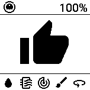

# HomeAssistant OpenEPaperlink Automations

This is some of my OpenEPaperLink automations.

## Roborock S7 robot vacuum



Displays a thumbs up or down indicating the overall status of the robot, 
together with the individual status for the following sensors. 

 - Battery charge
 - Filter cleaning time left
 - Sensors cleaning time left
 - Main brush time left
 - Side brush time left

Designed for display size 152x152 pixels.

```yaml
service: open_epaper_link.drawcustom
target:
  entity_id: open_epaper_link.0000021ebee83418
data:
  background: white
  rotate: 0
  ttl: 300
  payload:
    - type: icon
      value: robot-vacuum
      x: 4
      "y": 0
      size: 24
      color: black
    - type: text
      font: rbm.ttf
      value: "{{ states('sensor.roborock_s7_batteri') }}%"
      x: 148
      "y": 6
      size: 20
      anchor: rt
    - type: line
      x_start: 0
      x_end: 152
      y_start: 24
      y_end: 24
      width: 1
      fill: black
    - type: icon
      value: |-
        {{ 'mdi:thumbs-up' if 
          states('binary_sensor.roborock_s7_vattenbrist') != 'on' and
          (states('sensor.roborock_s7_filtertid_kvar') | int) > 0 and
          (states('sensor.roborock_s7_sensortid_kvar') | int) > 0 and
          (states('sensor.roborock_s7_huvudborste_tid_kvar') | int) > 0 and
          (states('sensor.roborock_s7_sidoborste_tid_kvar') | int) > 0
        else 'mdi:thumbs-down' }}
      x: 75
      "y": 75
      size: 90
      color: |-
        {{ 'black' if 
          states('binary_sensor.roborock_s7_vattenbrist') != 'on' and
          (states('sensor.roborock_s7_filtertid_kvar') | int) > 0 and
          (states('sensor.roborock_s7_sensortid_kvar') | int) > 0 and
          (states('sensor.roborock_s7_huvudborste_tid_kvar') | int) > 0 and
          (states('sensor.roborock_s7_sidoborste_tid_kvar') | int) > 0
        else 'red' }}
      anchor: mm
    - type: line
      x_start: 0
      x_end: 152
      y_start: 124
      y_end: 124
      width: 1
      fill: black
    - type: icon
      value: >-
        {{ 'mdi:water-warning' if 
          states('binary_sensor.roborock_s7_vattenbrist') == 'on' else 'mdi:water'
        }}
      x: 2
      "y": 128
      size: 24
      color: >-
        {{ 'red' 
          if states('binary_sensor.roborock_s7_vattenbrist') == 'on' else
        'black' }}
    - type: icon
      value: mdi:air-filter
      x: 32
      "y": 128
      size: 24
      color: >-
        {{ 'black' if 
          (states('sensor.roborock_s7_filtertid_kvar') | int) > 0
        else 'red' }}
    - type: icon
      value: mdi:radar
      x: 62
      "y": 128
      size: 24
      color: >-
        {{ 'black' if 
          (states('sensor.roborock_s7_sensortid_kvar') | int) > 0
        else 'red' }}
    - type: icon
      value: mdi:brush
      x: 92
      "y": 128
      size: 24
      color: >-
        {{ 'black' if 
          (states('sensor.roborock_s7_huvudborste_tid_kvar') | int) > 0 
        else 'red' }}
    - type: icon
      value: mdi:rotate-360
      x: 122
      "y": 128
      size: 24
      color: >-
        {{ 'black' if 
          (states('sensor.roborock_s7_sidoborste_tid_kvar') | int) > 0 
        else 'red' }}
```

# Elecrow Growcube watering device


Displays a thumbs up or down indicating the water level state of the device, together with the 
moisture level of each channel.

Designed for display size 152x152 pixels. 

```yaml
service: open_epaper_link.drawcustom
target:
  entity_id: open_epaper_link.0000021dc9fe341c
data:
  background: white
  rotate: 0
  ttl: 300
  payload:
    - type: line
      x_start: 0
      y_start: 38
      x_end: 151
      y_end: 38
      width: 1
      fill: black
    - type: line
      x_start: 0
      y_start: 76
      x_end: 151
      y_end: 76
      width: 1
      fill: black
    - type: line
      x_start: 76
      y_start: 0
      x_end: 76
      y_end: 76
      width: 1
      fill: black
    - type: text
      value: "{{ states('sensor.growcube_c13acc_moisture_a') }} %"
      font: ppb.ttf
      x: 38
      "y": 19
      size: 20
      color: black
      anchor: mm
    - type: text
      value: "{{ states('sensor.growcube_c13acc_moisture_b') }} %"
      font: ppb.ttf
      x: 114
      "y": 19
      size: 20
      color: black
      anchor: mm
    - type: text
      value: "{{ states('sensor.growcube_c13acc_moisture_c') }} %"
      font: ppb.ttf
      x: 38
      "y": 57
      size: 20
      color: black
      anchor: mm
    - type: text
      value: "{{ states('sensor.growcube_c13acc_moisture_d') }} %"
      font: ppb.ttf
      x: 114
      "y": 57
      size: 20
      color: black
      anchor: mm
    - type: icon
      value: >-
        {{ 'thumbs-down' if  states('binary_sensor.growcube_c13acc_water_level')
        == 'on' else 'thumbs-up' }}
      x: 76
      "y": 114
      size: 40
      color: >-
        {{ 'red' if states('binary_sensor.growcube_c13acc_water_level') == 'on'
        else 'black' }}
      anchor: mm
```